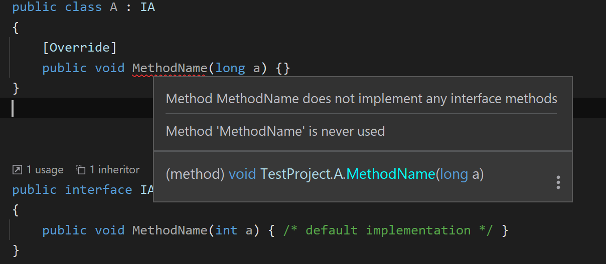

This analyzer allows declaring members of a class to be marked with `[Override]` attribute and will ensure that the member implements a method in one of the inherited interfaces. This condition is hard to detect if interface provides default interface implementation. 

 